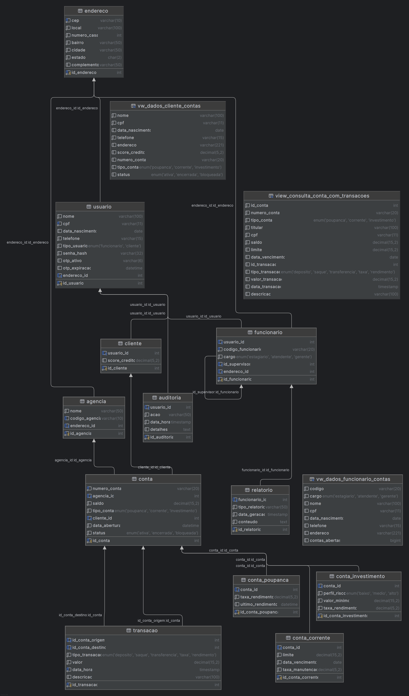

<h1 align="center">🏦 <strong>CALISTO BANK</strong> 🧠</h1>

<p align="center">
Sistema bancário acadêmico desenvolvido com <strong>Java</strong>, <strong>JDBC</strong>, <strong>MySQL</strong> e <strong>JSP/Servlets</strong>.<br>
🎓 Projeto universitário com foco em práticas de POO, CRUD e integração com banco de dados relacional.
</p>

---

## 📌 Visão Geral

O **CALISTO BANK** é um sistema bancário completo criado como projeto acadêmico. Ele possibilita:

- 📥 Cadastro de clientes, contas e funcionários;
- 🔍 Consulta de informações e contas por CPF ou nome;
- 🔄 Atualização de dados e status de contas;
- ❌ Encerramento de contas;
- 💸 Execução de transações como saque, depósito, transferência, taxa e rendimento;
- 🔐 Autenticação de usuários com perfis diferenciados (cliente e funcionário).

O sisO sistema foi projetado com **Java 21**, utilizando **JDBC puro** para comunicação com um banco **MySQL**. A interface utiliza **HTML/CSS** com páginas `JSP`, e o backend é estruturado em `Servlets`.

Além disso, o projeto segue o padrão de arquitetura **MVP (Model-View-Presenter)** com uma camada de **Services** intermediando a lógica entre os controladores (`Servlets`) e os DAOs, garantindo melhor organização e manutenibilidade do código.

---


| 👤 Participante                  | 🛠️ Área  | 🌐 GitHub                                            |
| -------------------------------- | --------- | ---------------------------------------------------- |
| Gilmar Viriato de Queiroz Junior | Back-End  | [@Gilmar-Viriato](https://github.com/Gilmar-Viriato) |
| **Isaque Costa Aragao**          | Back-End  | [@isaqxd](https://github.com/isaqxd)                 |
| Luis Eduardo Oliveira Maia       | Front-End | [@SunshasDev](https://github.com/SunshasDev)         |
| Luiz Gustavo Gouvea Damascena    | Front-End | [@gusta-xis](https://github.com/gusta-xis)           |


---

## 🎯 Lean Inception

O desenvolvimento do sistema foi guiado pela metodologia **Lean Inception**, com foco na validação rápida e eficiente do MVP (Produto Mínimo Viável). As atividades realizadas incluíram:

### 📋 Canvas MVP

- **Público-alvo**: Jovens que precisam de praticidade e menos burocracia em serviços bancários.
- **Proposta**: Um banco com atendimento 100% online e interface simples e intuitiva.
- **Funcionalidades principais**:
    - Cadastro de usuários e contas
    - Autenticação e OTP
    - Menus personalizados para cliente e funcionário
    - Geração de relatórios
- **Meta**: Implementar um sistema funcional, acessível e de fácil uso.

### 📌 Sequenciador de Funcionalidades

Organizamos as funcionalidades em 4 ondas de entrega:

1. Submenu por tipo de usuário, cadastro do funcionário e autenticação (RF 1.1, RF 2.5)
2. Menu do cliente e do funcionário
3. Lógica de login com critérios e OTP, encerramento de sessão
4. Geração de relatório e redirecionamentos pós-login

> 🔗 **Arquivos adicionais**:
> - 📄 [Personas](docs/Personas.pdf)
> - 📄 [Visão do Produto](docs/Visão%20do%20produto%20.pdf)
> - 📄 [Sequenciador](docs/Sequenciador.pdf)
> - 📄 [Canva MVP](docs/Canvas%20MVP.pdf)


---

## 🚀 Tecnologias Utilizadas

| Camada         | Tecnologia             |
|----------------|------------------------|
| 📐 Arquitetura | MVP com camada Service |
| 💻 Backend     | Java 21, Servlets      |
| 🗄️ Banco de Dados | MySQL + JDBC           |
| 🎨 Interface   | HTML, CSS, JSP         |
| ⚙️ Build Tool  | Maven                  |
| 🌐 Servidor    | Apache Tomcat 10.1.42  |
| 🧠 Padrões     | Programação Orientada a Objetos (POO) |

---

## 🛠️ Guia de Instalação Local

### ✅ Pré-requisitos

- Java 21
- MySQL 8.x
- Apache Tomcat 10.1.42
- Maven
- IntelliJ IDEA (ou IDE compatível com Java Web)

---

### 🔧 Passo a Passo

#### 1. Clone o Repositório

```bash
git clone https://github.com/seu-usuario/seu-repositorio.git
````
#### 2. Configure o Banco de Dados
- Crie o banco com o nome calisto
- Execute os scripts SQL para criar as tabelas e views
- Verifique se o usuário e senha estão corretos no arquivo de conexão JDBC

```sql
-- Em seguida, execute o script de criação das tabelas que está na pasta Util
```
- Credenciais padrão sugeridas:
```properties
Usuário: root
Senha: (vazia ou 'root')
```

#### 3. Abra o Projeto no IntelliJ
- Vá em File > Open e selecione a pasta do projeto
- Espere o Maven importar as dependências

#### 4. Configure o Tomcat
- Vá em Add Configuration > Tomcat Server > Local
- Aponte para o Tomcat 10.1.42 instalado
- Configure o artefato war exploded para o projeto

#### 5. Rode a Aplicação
- Clique em Run ou pressione Shift + F10

- Acesse http://localhost:8080/calisto no navegador

### 🧱 Diagrama ER do Banco de Dados

Abaixo está o diagrama entidade-relacionamento do banco de dados utilizado no projeto:



---


### 📃 Licença
Este projeto é de cunho acadêmico e não possui licença de distribuição comercial.

### 📩 Contato
Dúvidas? Sugestões? Entre em contato com qualquer membro da equipe através do GitHub acima!